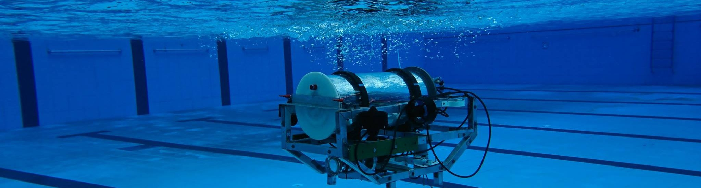
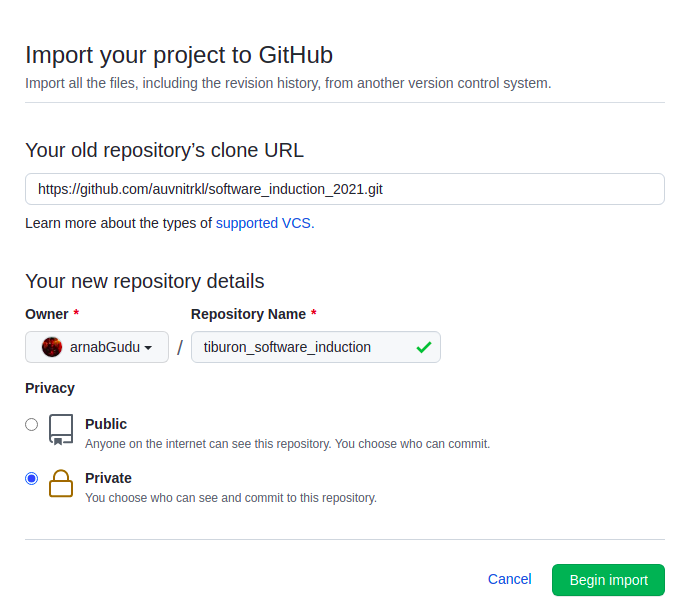

# Team Tiburon Software Inductions 2021

<div>
Follow us on Social Media
<br/>
<br/>
<a href="https://www.linkedin.com/school/tiburonauv/">
  
</a>
<a href="https://www.instagram.com/auvnitrkl/">
  
</a>
<a href="https://www.facebook.com/tiburonauv">
  
</a>
<a href="https://auvnitrkl.github.io/">
  
</a>
</div>
<br/>
<br/>
<br/>


Team Tiburon welcomes you to the Software Induction 2021 for Sophomores. This induction consists of a three weeks simulation challenge followed by a personal interview.

A Tiburon Software Member has the following responsibilities:
1. Perception: Develop software to perceive and process the environment using various sensors.
2. Navigation: Control strategies and path planning algorithms to maneuver the robot
3. Simulation: Present a proof of concept before jumping into costly hardware.
4. Hardware Integration: Develop driver code for various peripherals.

This induction process aims to test and prepare a sophomore to undertake all the responsibilities mentioned above.

## Prerequisites:
1. Intermediate knowledge in C++, ROS, SDF/URDF scripting, and Gazebo Simulation.
3. Basic knowledge of Control Systems (PID Controller).
4. Experience in Computer Vision and OpenCV library.

## General Instructions:
1. [GitHub Discussions Section](https://github.com/auvnitrkl/software_induction_2021/discussions) shall be used as the communication platform for all announcements, discussions, and Q&A.

2. Raise technical issues or bugs in [GitHub Issues Section](https://github.com/auvnitrkl/software_induction_2021/issues). We will do our best to solve all the issues.

3. Follow this [Getting Started](GETTING_STARTED.md) for all installation walkthroughs and setup guide.

## Problem Statement:
In the midst of a war, Team Tiburon is assigned a defense contract to build an acoustic torpedo missile capable of following surface vessels, submarines, and enemy torpedos. The team needs to simulate the design and present a proof of concept.

## Your Tasks, _should you choose to accept it_
1. Model the torpedo in Gazebo. <span style="color:red;bold;font-weight:bold">Coming Soon</span>

2. Simulate the Torpedo to detect and destroy an enemy submarine. <span style="color:red;bold;font-weight:bold">Coming Soon</span>

## Submission Guidelines:

1. Visit https://github.com/new/import and fill in the details as mentioned below. **Note: Make sure to select the Private option.**


2. Clone & Build the Repository:
```sh
cd ~/tiburon_ws/src
```
```sh
git clone git@github.com:<your_github_username>/tiburon_software_induction.git
```
```sh
git remote add public https://github.com/auvnitrkl/software_induction_2021.git
```
```sh
catkin build
```

3. You will be asked to add one of the Tiburon Software Mentor to your repository as a collaborator at the end of week 1.

4. Regularly commit and push your changes in your private repository, which your mentor will watch.

5. When a new task is uploaded in the auvnitrkl public repository, you have to merge those changes in your private repository using the following commands. (If a message prompts in the terminal regarding merge, press Ctrl+x to exit)
```sh
git pull public main
```
```sh
git push origin main
```
