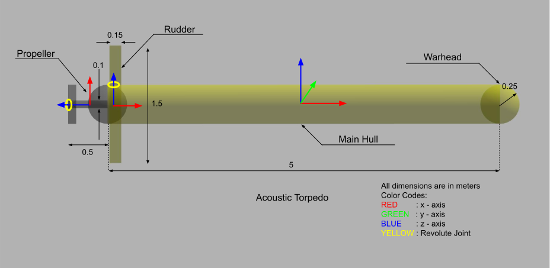

# Task 1: Develop Torpedo Model
An acoustic torpedo is a torpedo that aims itself by listening for characteristic sounds of its target or by searching for it using sonar (acoustic homing). ([wiki](https://en.wikipedia.org/wiki/Acoustic_torpedo))

## Your Objective:
To design a Torpedo model that can surge and maneuver horizontally. Gravity is turned off to ease this simulation. A sample design is posted below for reference. However, feel free to be creative in your design.

## About this Task:
This task aims to test your knowledge in model building and basic SDF concepts such as:
- Links and Joints
- Collision and Visual Components
- Model Plugins  

## How should you proceed:
1. There are two approaches to model a robot in the gazebo
   - Writing SDF (Standard Description Format) file from scratch ([Tutorial](http://gazebosim.org/tutorials?tut=build_robot)) -  **Recommanded**
   - Using Gazebo GUI Model Editor ([Tutorial](http://gazebosim.org/tutorials?tut=guided_b3))

2. If you choose to write SDF file, then navigate to [models/torpedo/model.sdf](models/torpedo/model.sdf) and fill the `<!--TODO-->` section.
  

  
  

3. Lastly, add **LiftDrag Plugin** to the propellers so that when joint velocity is applied to the propellers, it will generate a forward thrust using LiftDrag Plugin. **[More on LiftDrag Plugin](https://gazebosim.org/tutorials?tut=aerodynamics&cat=physics)**

4. Same goes for the Rudder as well. After adding the LiftDrag plugin to it, when it is rotated by some angle, it would generate a sideways thrust resulting in yaw motion.

## How to run:
To launch gazebo simulator with along with torpedo use `roslaunch torpedo demo.launch`. Initially there won't be any torpedo visible, because [models/torpedo/model.sdf](models/torpedo/model.sdf) is yet to be filled.
